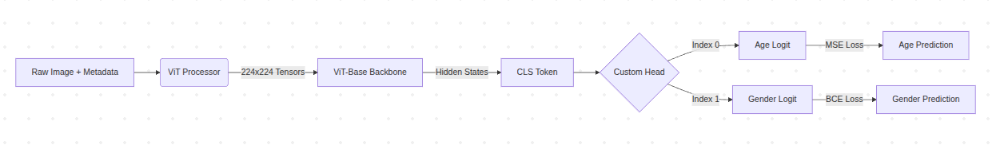

# Age-Gender Prediction with HuggingFace ViT

This repository contains a two-stage training pipeline for an age and gender prediction model using a Vision Transformer (ViT) backbone. It is built on HuggingFace Transformers, Torch, and Datasets, and includes custom training code for both UTKFace and FairFace datasets.

## Project Overview

- `model.py`: Custom `AgeGenderViTModel` based on `ViTPreTrainedModel`.
- `script.py`: Stage 1 training script for UTKFace-based age and gender learning.
- `fine_tune.py`: Stage 2 fine-tuning script using FairFace to improve generalization.
- `inference.py`: Simple inference example for the final trained model.
- `load_data.py`: Dataset loader example using HuggingFace `FairFace` dataset.

## System Flowchart



## What the model predicts

The model outputs a single tensor with two values:
- `logits[0]`: predicted age as a regression value.
- `logits[1]`: gender probability for female, using a sigmoid activation.

Gender is interpreted as:
- `Female` if probability >= 0.5
- `Male` if probability < 0.5

## Repository Layout

- `age_gender_fine_tuned/`: checkpoints produced by UTKFace training.
- `fairface_finetuned/`: checkpoints produced by FairFace fine-tuning.
- `final_production_model/`: saved final model ready for inference.
- `data/`: local data directories containing `train/` and `validation/` metadata and images.
- `UTKFace/`: UTKFace image folder plus generated `metadata.csv`.
- `images/`: example image inputs for inference.

## Requirements

Install dependencies before running the scripts:

```bash
pip install torch torchvision transformers datasets pandas pillow
```

If you use GPU training, ensure your PyTorch installation supports CUDA.

## Usage

### 1. Train on UTKFace

`script.py` loads the UTKFace folder and trains a base age-gender model.

```bash
python script.py
```

Expected behavior:
- Loads `abhilash88/age-gender-prediction` model and processor.
- Builds train/test split from `./UTKFace`.
- Trains with a custom `MultiTaskTrainer` that combines age regression and gender loss.
- Saves checkpoints to `./age_gender_fine_tuned`.

### 2. Fine-tune on FairFace

`fine_tune.py` loads a UTKFace checkpoint and fine-tunes on FairFace data.

```bash
python fine_tune.py
```

Key details:
- Uses a custom `FairFaceLocalDataset` for FairFace CSV metadata.
- Converts age groups into numeric age labels using `AGE_MAP`.
- Uses a `Stage2Trainer` with weighted age and gender losses.
- Saves the final model to `./final_production_model`.

### 3. Run inference

`inference.py` demonstrates how to load the saved model and predict on a single image.

```bash
python inference.py
```

Output includes:
- predicted age
- predicted gender
- confidence score

## Data Requirements

### UTKFace

The training expects `UTKFace/` to contain images and a generated `metadata.csv` with at least these columns:
- `filename`
- `age`
- `gender`

### FairFace

The fine-tuning stage expects FairFace metadata in:
- `data/train/metadata.csv`
- `data/validation/metadata.csv`

and corresponding image folders in:
- `data/train/`
- `data/validation/`

## Model Architecture

`model.py` defines `AgeGenderViTModel`:
- ViT backbone without pooling layer.
- Age head: regression output.
- Gender head: sigmoid probability output.
- Combined logits returned as a 2-element tensor.

## Notes

- `remove_unused_columns=False` is required in training arguments because the dataset returns custom label keys.
- `fine_tune.py` uses `BCEWithLogitsLoss` for gender and `MSELoss` for age.
- `script.py` uses a smaller weight on age loss to balance learning.

## Extending this project

- Add a prediction wrapper around `model.py` for batch inference.
- Create a dataset conversion script to standardize `metadata.csv` across datasets.
- Add evaluation scripts for age MAE and gender classification accuracy.
